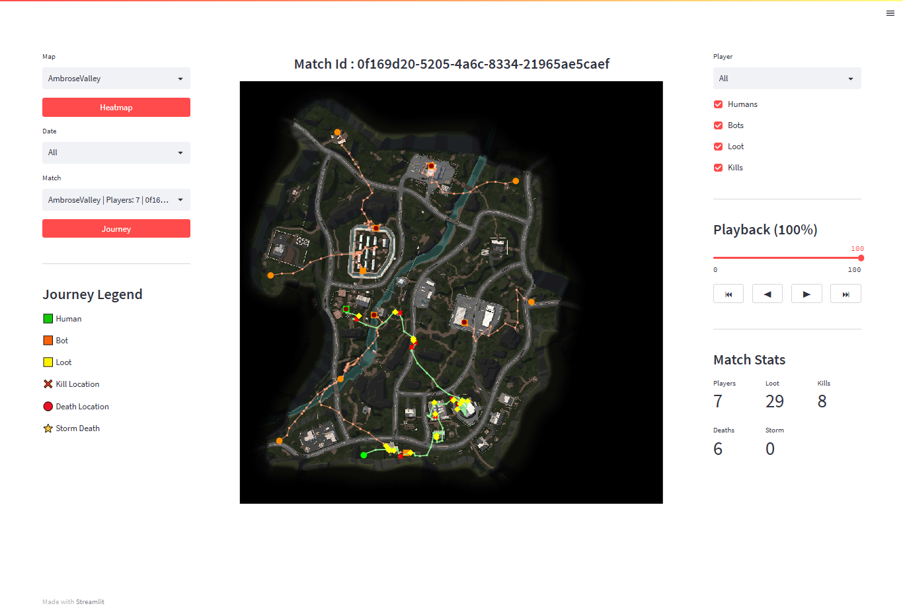
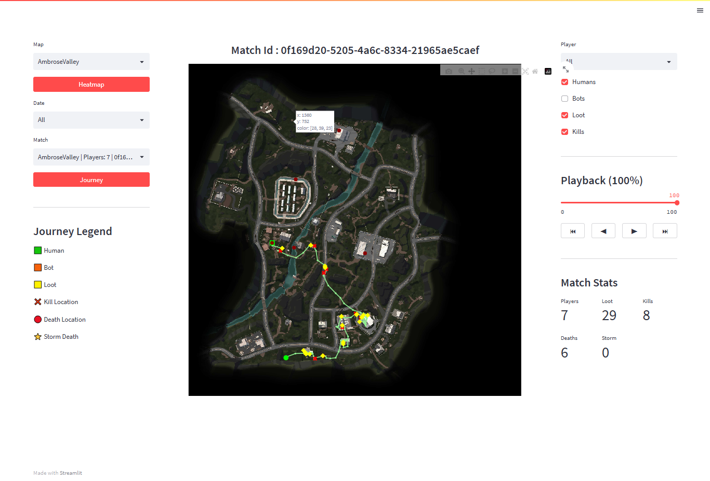
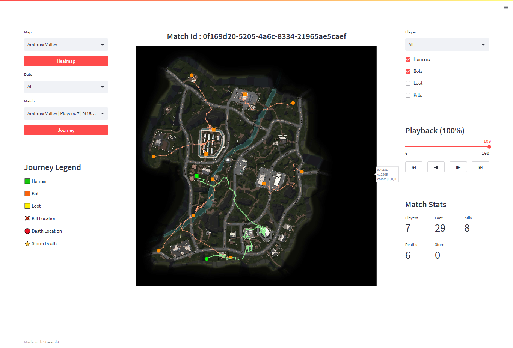
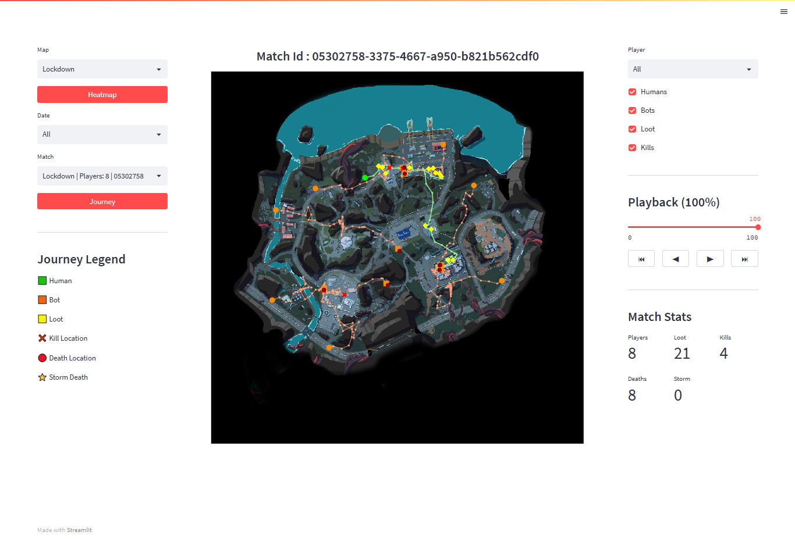
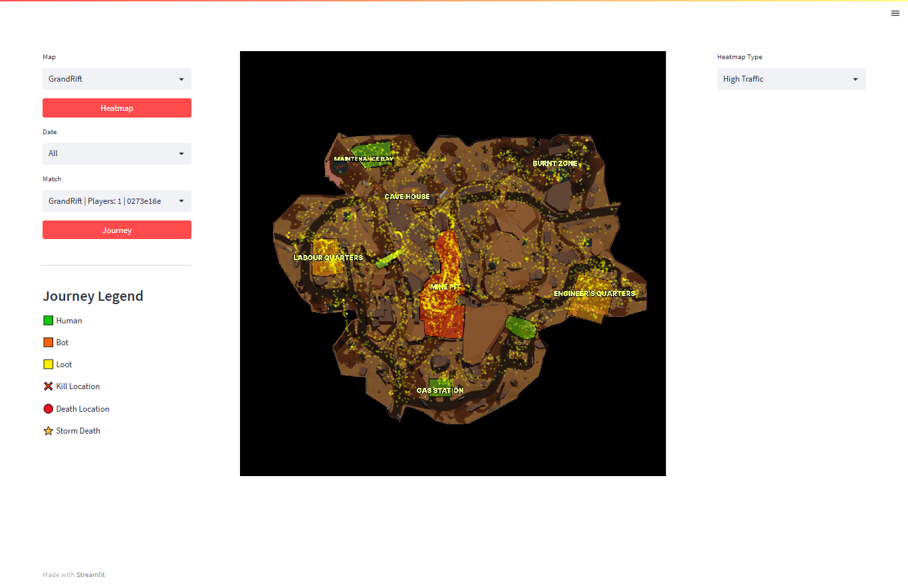
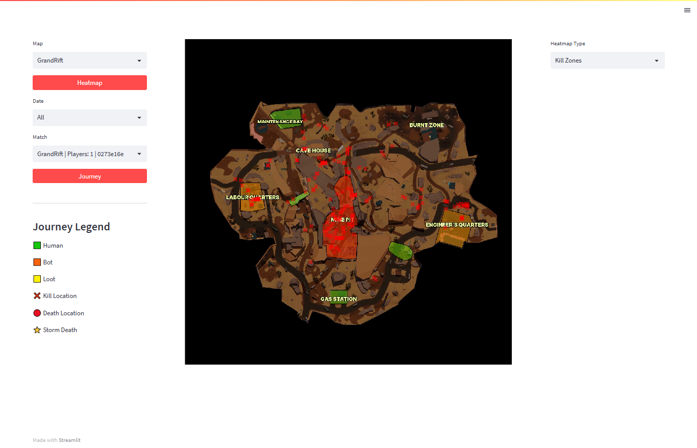

# LILA BLACK - Player Journey Visualization Tool

## What is this?

This project is an interactive visualization tool developed for exploring player telemetry data from LILA BLACK.

The application enables designers and analysts to:

- Load and parse gameplay telemetry stored in parquet files
- Inspect player journeys
- Analyze combat encounters
- Visualize loot collection
- Reconstruct match timelines
- Identify high traffic areas
- Explore aggregated heatmaps

---

## Features

### Journey Visualization

Supports:

- Human player trajectories
- Bot trajectories
- Start position markers
- End position markers
- Loot markers
- Kill markers
- Death markers
- Storm death markers

### Heatmaps

Supports:

- High Traffic Areas
- Kill Zones
- Death Zones

Heatmaps aggregate telemetry across all matches belonging to the selected map.

### Playback

Supports:

- Playback slider
- Step backward
- Step forward
- Jump to start
- Jump to end

Movement trajectories and events progressively appear as playback advances, allowing designers to reconstruct the timeline of a match.

### Filters

Supports filtering by:

- Map
- Date
- Match
- Player

Journey mode also supports:

- Humans
- Bots
- Loot
- Kills

---

## Technology Stack

- Python
- Streamlit
- Plotly
- Pandas
- NumPy
- PyArrow
- Pillow

---

## Project Structure

```
project/
│── app.py                  # Main Streamlit application
│── loader.py               # Load and preprocess parquet data
│── config.py               # Map and heatmap configuration
│── coordinate_mapper.py    # World to minimap coordinate conversion
│── map_utils.py            # Visualization helper functions
│── requirements.txt
│── README.md
│── ARCHITECTURE.md

├── minimaps/               # Minimap images
├── player_data/            # Gameplay telemetry parquet files
├── screenshots/            # README screenshots
```

---

## Screenshots

### Journey View





### Playback View




### Heatmap View





## Hosted Application:

https://sj-sltest.streamlit.app

The application is publicly accessible via the link above and requires no local setup.